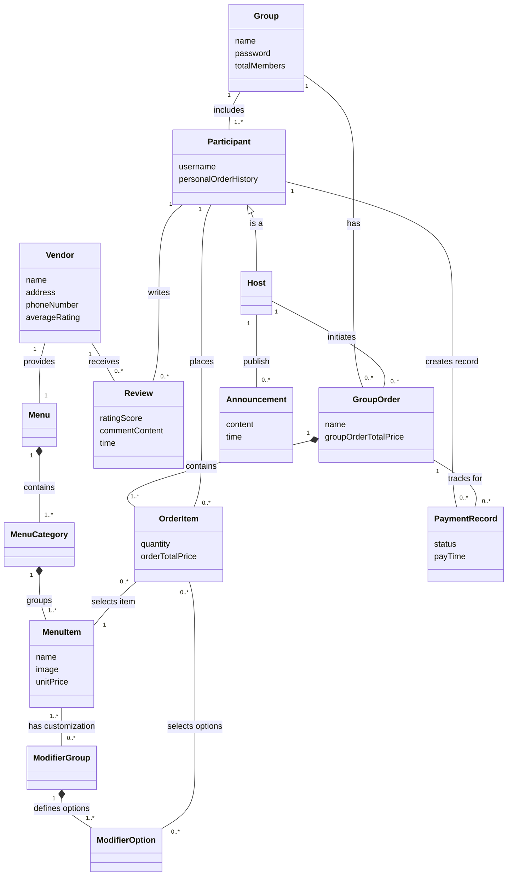

```mermaid
classDiagram
  direction TB
  class Group {
     name
     password
     totalMembers
  }
  class Host {
   
  }
  class Participant {
     username
     personalOrderHistory
  }
  class Vendor {
     name
     address
     phoneNumber
     averageRating
  }
  class Menu {
   
  }
  class Review {
     ratingScore
     commentContent
     time
  }
  class MenuCategory {
 
  }
  class MenuItem {
     name
     image
     unitPrice
  }
  class ModifierGroup {
   
  }
  class ModifierOption {
   
  }
  class GroupOrder {
     name
     groupOrderTotalPrice
  }
  class OrderItem {
     quantity
     orderTotalPrice 
  }
  class PaymentRecord {
     status
     payTime
  }
  class Announcement {
     content
     time
  } 
  
  %% 人物/角色與群組/訂單
  Participant <|-- Host : is a
  Group "1" -- "1..*" Participant : includes
  Group "1" -- "0..*" GroupOrder : has
  Host "1" -- "0..*" GroupOrder : initiates
  Host "1" -- "0..*" Announcement  : publish
  %% 菜單結構 (Composition)
  Vendor "1" -- "1" Menu : provides
  Vendor "1" -- "0..*" Review : receives
  Menu "1" *-- "1..*" MenuCategory : contains
  MenuCategory "1" *-- "1..*" MenuItem : groups
  ModifierGroup "1" *-- "1..*" ModifierOption : defines options
  MenuItem "1..*" -- "0..*" ModifierGroup : has customization
  %% 訂單/餐點結構
  GroupOrder "1" *-- "1..*" OrderItem : contains
  Participant "1" -- "0..*" OrderItem : places
  OrderItem "0..*" -- "1" MenuItem : selects item
  OrderItem "0..*" -- "0..*" ModifierOption : selects options
  %% 財務/評價紀錄
  Participant "1" -- "0..*" PaymentRecord : creates record
  GroupOrder "1" -- "0..*" PaymentRecord : tracks for
  Participant "1" -- "0..*" Review : writes
```